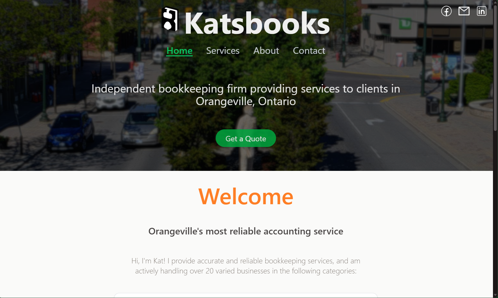
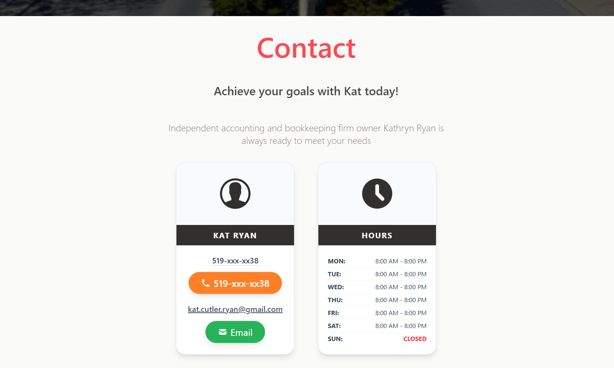
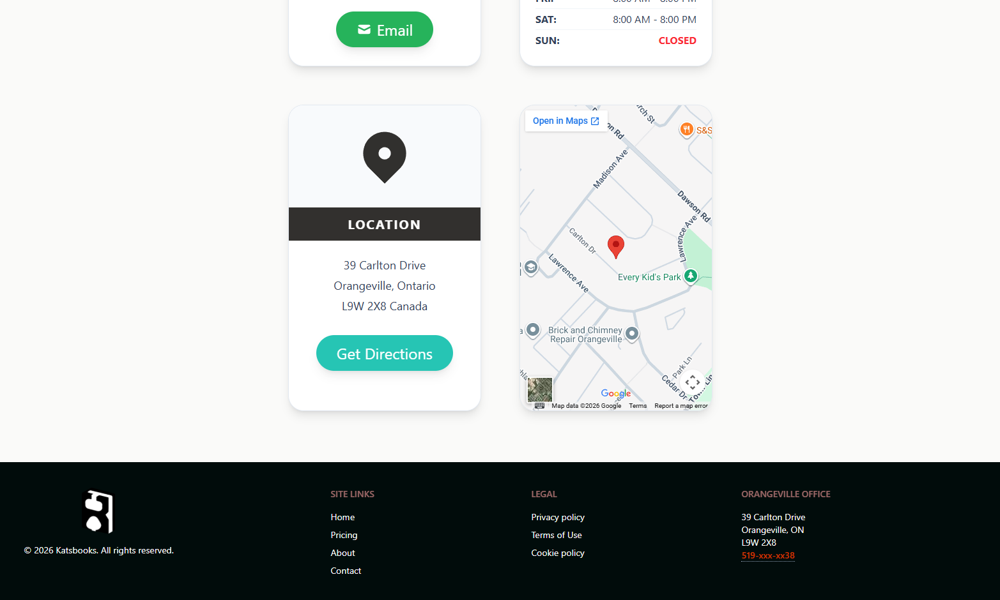

# KatsBooks

An overkill static Next.js web application for bookkeeping services information. Initially designed using pure HTML/CSS/Javascript, adapted to Next.js for cleaner, more professional presentation (and to practice Next.js app deployment over different platforms)

## Live Website (Web Hosting Canada Deployment)

https://katsbooks.ca

## Live Demo (Vercel Deployment)

https://katsbooks.vercel.app

## Screenshots




## Tech Stack

[](https://react.dev)
[](https://nextjs.org)
[](https://www.typescriptlang.org)
[](https://tailwindcss.com)

## Installation
```bash
git clone https://github.com/nicksquires/katsbooks
npm install
npm run dev
```
